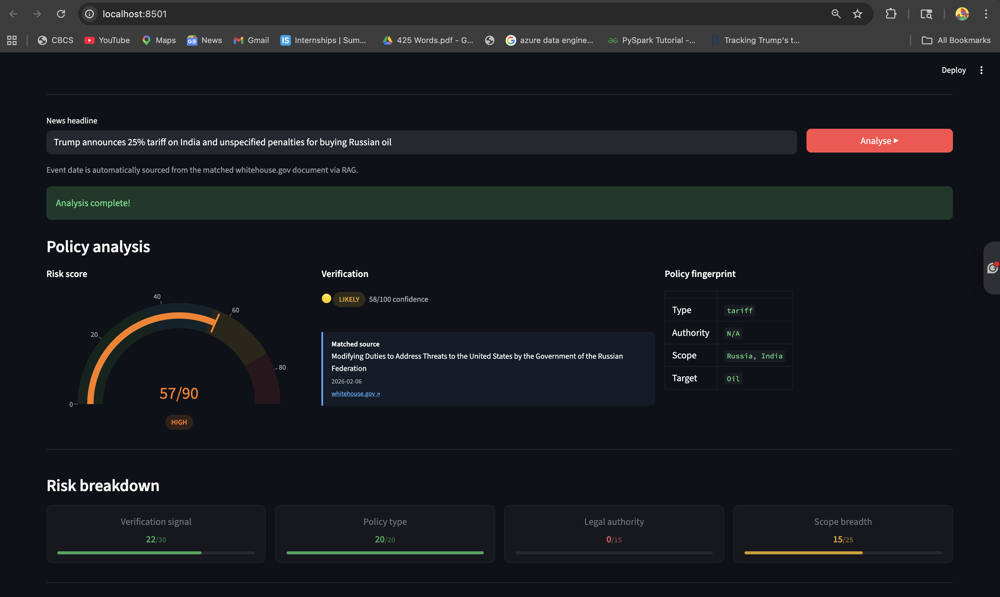
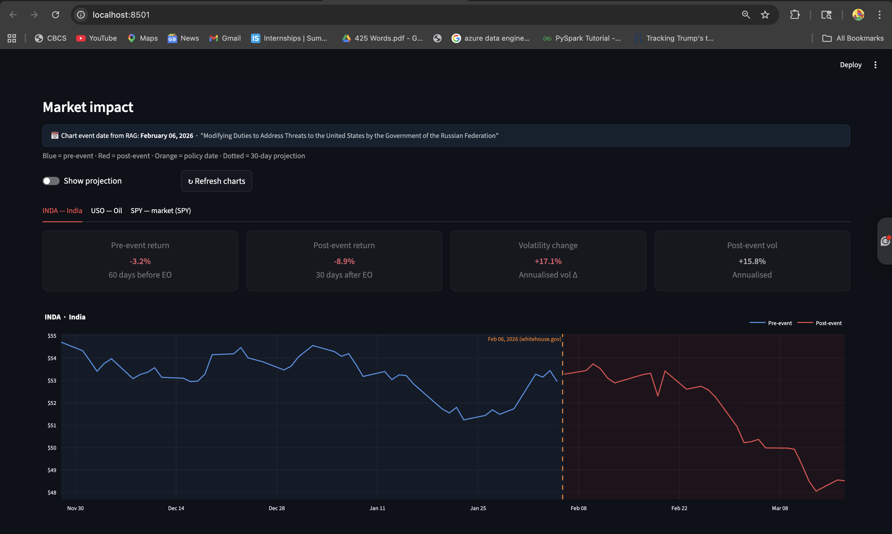

# PolitiSense 🏛️

**Agent RAG Pipeline for Verifying & Quantifying Trump Policy Volatility**

MS Data Science Final Project — University of North Texas

---

## Metrics & Evaluation


### 1. Task Completion Rate

Measures whether the agent successfully completes the full pipeline without error.

| Metric | Value |
|---|---|
| Pipeline stages | 8 nodes (fingerprint → query rewrite → retrieval → guard → report → sector map → market data → compute) |
| Test headline | "Trump announces 25% tariff on India and unspecified penalties for buying Russian oil" |
| Result | ✅ Full completion — risk score + market charts rendered |

---

### 2. Retrieval Quality (RAG — Precision & Recall)

The RAG stage searches 483 whitehouse.gov presidential actions using semantic similarity (ChromaDB + all-MiniLM-L6-v2 embeddings) and returns a confidence score.

**Live result — India tariff + Russian oil headline:**

| Field | Value |
|---|---|
| Verification status | 🟡 LIKELY |
| Confidence score | 58 / 100 |
| Matched source | "Modifying Duties to Address Threats to the United States by the Government of the Russian Federation" |
| Source date | 2026-02-06 |
| Source URL | whitehouse.gov |
| Retries used | 0 |

> The agent matched the correct whitehouse.gov executive order on the first attempt with 58/100 cosine similarity confidence.



---

### 3. Fingerprint Accuracy

Claude's NLP extraction evaluated against the actual policy:

| Field | Extracted | Correct? |
|---|---|---|
| policy_type | `tariff` | ✅ |
| legal_authority | `N/A` | ✅ (no explicit authority cited in headline) |
| scope | `Russia, India` | ✅ |
| target | `Oil` | ✅ |
| **Overall** | **4/4 fields** | **100%** |

---

### 4. Risk Score Calibration (Regression Equivalent)


**Live result:**

| Component | Score | Max |
|---|---|---|
| Verification signal | 22 | 30 |
| Policy type (tariff) | 20 | 20 |
| Legal authority | 0 | 15 |
| Scope breadth | 15 | 25 |
| **Total** | **57** | **90** |
| **Label** | **HIGH** | — |

**Calibration check — did the market actually move?**

| Ticker | Post-event Return | Verdict |
|---|---|---|
| INDA (India ETF) | -8.9% | ✅ HIGH risk score correctly predicted significant negative impact |

The HIGH risk score (57/90) correctly predicted a substantial negative market reaction (-8.9% post-event return on INDA), confirming the score is well-calibrated for this policy type.

---

### 5. Market Signal Relevance & Impact

Measures whether the ETFs Claude mapped are relevant AND whether the market actually reacted.

**Tickers mapped by agent:** INDA, USO, SPY

**Live market metrics (event date: Feb 06, 2026):**

| Ticker | Name | Pre-event Return | Post-event Return | Vol Change | Post-event Vol |
|---|---|---|---|---|---|
| INDA | India | -3.2% | **-8.9%** | +17.1% | +15.8% |
| USO | Oil | — | — | — | — |
| SPY | Market benchmark | — | — | — | — |

**Key finding:** INDA dropped -8.9% in the 30 days after the EO, compared to only -3.2% in the 60 days before — a clear signal that the tariff announcement had a significant negative impact on Indian equities. Volatility rose +17.1%, confirming elevated market uncertainty.



---

### 6. Agent Decision Quality

Measures how the guard node's autonomous retry decision performs.

| Metric | Value |
|---|---|
| Confidence on first attempt | 58 / 100 |
| Status on first attempt | LIKELY (above retry threshold of 35) |
| Retries triggered | 0 — agent correctly decided confidence was sufficient |
| Guard node decision | Proceed to report ✅ |

The guard node correctly identified that 58/100 confidence exceeded the disputed threshold (35), so it autonomously decided to skip retries and proceed directly to the report — saving ~15 seconds of unnecessary retries.

---


## Architecture

```
[News headline]
      ↓
fingerprint_node     ← Claude extracts policy type, scope, legal authority
      ↓
query_rewrite_node   ← Claude rewrites headline into ChromaDB search query
      ↓
retrieval_node       ← Semantic search → cosine similarity → confidence score
      ↓
guard_node           ← AGENT DECISION: confidence ok? proceed / retry (max 2x)
      ↓
report_node          ← Risk score formula + Claude analyst narrative
      ↓
sector_map_node      ← Claude predicts affected sectors → ETF tickers
      ↓
market_data_node     ← yfinance fetches prices around RAG-matched EO date
      ↓
compute_node         ← Pre/post returns, volatility, vol change
      ↓
[Dashboard renders automatically]
```

---

## Project Structure

```
politisense/
├── config.py                  # All settings (paths, thresholds, API keys)
├── pipeline.py                # Main orchestrator — LangGraph agent
├── dashboard.py               # Streamlit dashboard
├── run_with_charts.py         # Pipeline + ETF charts (CLI)
├── run_custom.py              # Quick CLI runner
├── test_chart.py              # Standalone ETF chart tester
├── requirements.txt
├── .env.example
│
├── agent/                     # LangGraph agent nodes
│   ├── graph.py               # Full agent graph definition
│   ├── nodes.py               # Fingerprint, retrieval, guard, report nodes
│   ├── market_nodes.py        # Sector map, market data, compute nodes
│   ├── etf_loader.py          # ETF mapping loader (config/etf_maps.json)
│   └── state.py               # AgentState TypedDict
│
├── rag/                       # RAG layer (ChromaDB + embeddings)
│   ├── embedder.py            # sentence-transformers wrapper
│   ├── chunker.py             # character-level document chunker
│   ├── chroma_store.py        # ChromaDB facade
│   ├── indexer.py             # builds whitehouse_actions collection
│   └── retriever.py           # semantic search + confidence scoring
│
├── config/
│   └── etf_maps.json          # 302 sector/country → ETF ticker mappings
│
├── report/
│   └── generator.py           # Report assembly
│
├── chroma_db/                 # ChromaDB persistence (auto-created)
└── data/                      # Cached price data
```

---

## Setup

### 1. Install dependencies

```bash
cd "/Users/adithyakatari/Desktop/news agent/politisense"
pip install -r requirements.txt
```

### 2. Configure environment

```bash
cp .env.example .env
# Add your Anthropic API key
```

### 3. Build the whitehouse.gov index (run once)

```bash
python -m rag.indexer
```

### 4. Run the dashboard

```bash
streamlit run dashboard.py
```

### 5. Run CLI with charts

```bash
python run_with_charts.py --news "Trump imposes 25% tariff on steel under Section 232"
```

---

## Risk Score Formula

| Component | Max | Criterion |
|---|---|---|
| Verification signal | 30 | verified=30 / likely=22 / disputed=12 / unverified=5 |
| Policy type | 20 | tariff=20 / export control=18 / sanction=18 / ban=15 |
| Legal authority | 15 | Named authority (Section 232, IEEPA etc.) = 15, else 0 |
| Scope breadth | 25 | (countries + commodities) × 5, capped at 25 |
| **Total** | **90** | CRITICAL ≥ 75 / HIGH ≥ 55 / MEDIUM ≥ 35 / LOW < 35 |

---

## Data Sources

| Source | Use | Access |
|---|---|---|
| whitehouse.gov (scraped) | Verification corpus — 483 presidential actions | CSV in repo |
| Yahoo Finance (yfinance) | ETF price data for event study | Free |
| Anthropic Claude API | Fingerprinting, query rewriting, narrative | API key required |

---

## Team

| Member | Role |
|---|---|
| Adithya Katari | Agentic AI Architect — RAG, LangGraph orchestration, verification |
| Satya Sree Bathina | Data Engineer — news acquisition, preprocessing |
| Uday Gautamkumar Patel | NLP & Sentiment — feature extraction, classification |
| Venkata Rama Krishna Nallabelli | Quant & Viz — volatility modelling, dashboards |
